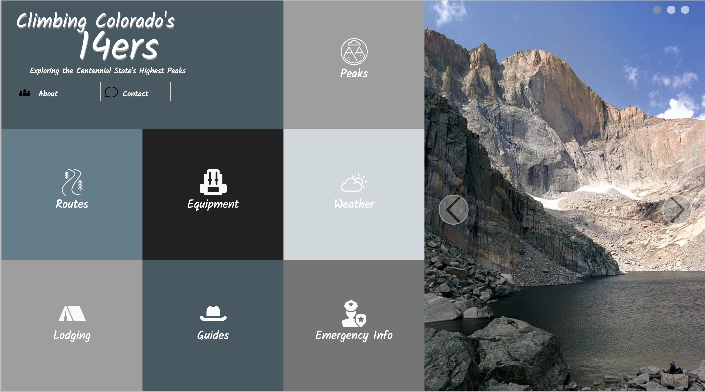

# Static Comp 1

## Overview

I chose to do my static comp on colorado's 14ers both for my passion towards these peaks, as well as creating the challenge of creating a color palette that would complement the natural colors in my picture of long's peak.  I chose a format that would be useful for people looking for more information on the peaks themselves, as well as information that would be required to successfully summit one of these peaks. 

## Original Comp

## My design

